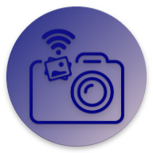
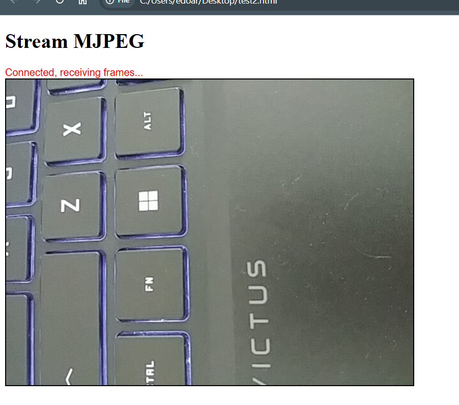

# Camera WIFI

 

## What is Camera WIFI?

Camera WIFI is not a traditional camera application, but it’s something different.
I developed this application to enable a high-performance stream of images directly from a Phone to a PC.

You can download from Google Play here:
* [Camera WIFI FREE (with ADS)](https://play.google.com/store/apps/details?id=com.edodm85.cameratcp.free)
* [Camera WIFI (without ADS)](https://play.google.com/store/apps/details?id=com.edodm85.cameratcp.paid)

 

## Supported protocols?

The application supports the following three protocols over TCP:

* DOT: custom protocol, described at this [link](https://github.com/edodm85/DOT_Protocol_Specification)

* MJPEG over HTTP (APP v3.1.1 or higher): is an extremely simple and effective video streaming method, based on the sequential delivery of independent JPEG images through a single persistent HTTP connection.

* ASCII (deprecated): first custom protocol

 

## How does it work?

If you select the DOT protocol:

1. Connect your phone and PC over the same WIFI network.

2. Open the "Camera WIFI" app on your phone.

3. Select the DOT protocol and press the "START CAMERA" button.

4. Open the PC client: PhoneTCPClient.

5. Insert the IP address of the Phone and press "Connect".

6. Press the "Snap" button and acquire the image

 

If you select the MJPEG protocol:

1. Connect your phone and PC over the same WIFI network.

2. Open the "Camera WIFI" app on your phone.

3. Select the MJPEG protocol and press the "START CAMERA" button.

4. Open the "Client_MJPEG.html" script in your web browser (NOTE: change the IP:PORT inside the script).

 

## Building PhoneTCPClient

For build [PhoneTCPClient](https://github.com/edodm85/CameraWIFI/tree/master/PhoneTCPClient/PhoneTCPClient_Source_Code) you need Visual Studio 2013 or above.

 

## Create your Client (Camera WIFI v3.0.0 or higher)

The protocol description is here: https://github.com/edodm85/DOT_Protocol_Specification

#### COMMANDS FOR RECEIVED IMAGES

1. START ACQUISITION: Send this array: [0xAA 0x1 0x0 0x0 0x0 0x3 0x1 0x11 0x55]

2. STOP ACQUISITION: Send this array: [0xAA 0x1 0x0 0x0 0x0 0x3 0x1 0x12 0x55]

3. ACQUIRE ONE IMAGE: Send this array: [0xAA 0x1 0x0 0x0 0x0 0x3 0x1 0x10 0x55]

#### RECEIVE IMAGES FROM CAMERA WIFI

The App sends an image, with this Bytes sequence: [0xAA 0x1 LENGHT 0x5 PAYLOAD 0x55]

 

 

## (DEPRECATED) Create your Client (All versions)

Camera WIFI accepts these commands via wifi:

#### COMMANDS FOR RECEIVED IMAGES

1. START ACQUISITION: Send the string "startGRAB"

2. STOP ACQUISITION: Send the string "stopGRAB"

3. ACQUIRE ONE IMAGE: Send the string "singleSNAP"

#### RECEIVE IMAGES FROM CAMERA WIFI

The App sends an image, in the first place it adds the string "sRt" and in the end the string "sTp".

So the client receives: "sRt" - Bytes image - "sTp"

#### COMMANDS FOR ENABLE/DISABLE SOME FUNCTIONS

1. ENABLE FLASH: Send the string "flashON"

2. DISABLE FLASH: Send the string "flashOFF"
          
3. ENABLE AUTOFOCUS: Send the string "focusON"

4. DISABLE AUTOFOCUS: Send the string "focusOFF"  

 

## License

> Copyright (C) 2026 edodm85.  
> Licensed under the MIT license.  
> (See the [LICENSE](https://github.com/edodm85/CameraWIFI/blob/master/LICENSE) file for the whole license text.)
